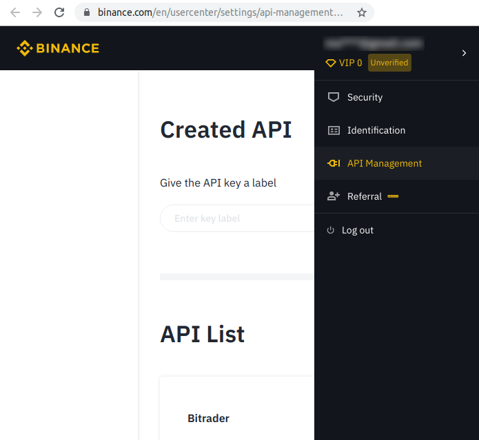

## BITrader - Trading and Alering Service for Binance Cryptocurrency Exchange


BITrader - Trading and Alering Service for Binance Cryptocurrency Exchange (http://binance.com):

 * Monitor all '\*BTC' symbols trades and detect pumps
 * Send crypto signals to the attached Telegram bot

### Prerequisites

```
sudo apt-get install g++ make binutils cmake libjsoncpp-dev libcurl4-nss-dev libssl-dev libboost-system-dev libboost-iostreams-dev
```

### Building

```
git clone --recurse-submodules https://github.com/dmikushin/bitrader.git
cd bitrader
git submodule init
git submodule update
mkdir build
cd build/
cmake ..
make -j12
```

### Deployment

The bot searches for api/secret API keys for Binance user account and reports error in case of failure. These keys are needed to get the available funds info and to perform buy/sell orders. Generate keys in Binance web interface on the "API management" panel:



Place the generated keys into the following files:

```
$HOME/.bitrader/key
$HOME/.bitrader/secret
```

Now start the trade bot:

```
./bitrader
```

### Liability

Use this program at your own risk. None of the contributors to this project are liable for any loses you may incur. Be wise and always do your own research.
